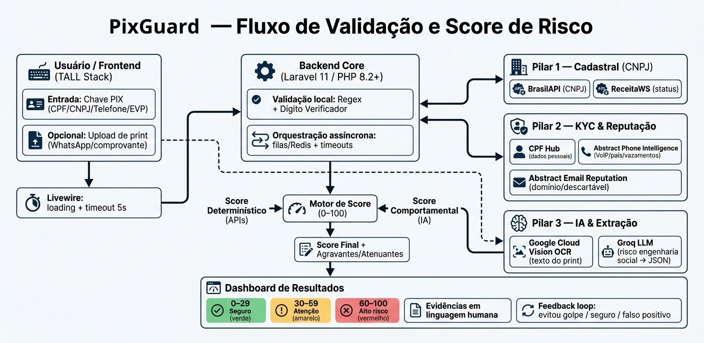

# PixGuard - Motor Heuristico e de IA para Prevencao a Fraudes PIX

## Visao Geral
O PixGuard atua como uma camada de inteligencia preventiva para analise de transacoes PIX. O sistema opera sem acesso direto ao barramento do Banco Central (DICT) e funciona como um orquestrador de dados, cruzando informacoes de provedores publicos e privados com analise contextual impulsionada por IA.

O objetivo e gerar um Score de Risco que ajude a frear acoes impulsivas sob ameaca, manipulacao psicologica e/ou engenharia social antes que o usuario realize uma transacao potencialmente fraudulenta.

## Arquitetura Tecnologica
- Core Backend: PHP 8.2+ com Laravel 11
- Banco de Dados: MySQL
- Fila e Cache: Redis
- Frontend (Apresentacao): TALL Stack (Tailwind CSS, Alpine.js, Laravel, Livewire)
- Painel Administrativo: FilamentPHP

## Integracoes Externas (APIs)
As integracoes sao organizadas em tres pilares funcionais.

### Pilar 1: Validacao Institucional e Cadastral
- `GET https://brasilapi.com.br/api/cnpj/v1/{cnpj}`: Validacao corporativa primaria
- `GET https://receitaws.com.br/v1/cnpj/{cnpj}`: Status ativo/inativo de empresas

### Pilar 2: Rastreabilidade Digital e Identidade (KYC)
- `GET https://api.cpfhub.io/cpf/{cpf}`: Nome completo, sexo biologico e data de nascimento
- `GET https://phoneintelligence.abstractapi.com/v1`: Natureza da linha, pais e historico de vazamentos
- `GET https://emailreputation.abstractapi.com/v1`: Idade do dominio, email descartavel e sinais de reputacao digital

### Pilar 3: IA e Extracao de Dados
- `POST https://vision.googleapis.com/v1/images:annotate`: OCR para extrair texto de capturas de tela
- `POST https://api.groq.com/openai/v1/chat/completions`: LLM para inferencia de risco de engenharia social

## Requisitos do Sistema

### Requisitos Funcionais (RF)
- RF01: Identificar formato da chave PIX por Regex e validar digito verificador quando aplicavel antes de qualquer requisicao externa.
- RF02: Permitir upload de imagens (prints) com conversas do suposto recebedor.
- RF03: Acionar Google Cloud Vision para OCR e extrair texto bruto.
- RF04: Enviar texto para a Groq com prompt rigoroso, retornando JSON com nota de risco contextual.
- RF05: Consumir APIs de KYC de forma assincrona e/ou com timeouts estritos.
- RF06: Fundir Score Deterministico (APIs) com Score Comportamental (IA).
- RF07: Exibir resultado com score numerico, cor de alerta e agravantes/atenuantes.

### Requisitos Nao Funcionais (RNF)
- RNF01 (LGPD): Chaves PIX consultadas nao podem ser salvas em texto plano. Historico deve usar hash para metricas e rate limiting.
- RNF02 (Resiliencia): Falhas em provedores externos nao podem gerar erro fatal; calcular score com heuristicas disponiveis.
- RNF03 (Performance): Processamento do LLM (Groq) nao deve exceder 3s de latencia total.

### Fluxo de Utilizacao (User Flow)
1. Entrada: Usuario insere chave PIX e opcionalmente envia um print com contexto.
2. Fallback de IA: Sem imagem, nao aciona Vision e Groq; calcula apenas Score Deterministico.
3. Processamento: Validacao no backend com frontend responsivo (loading) e timeout maximo de 5s.
4. Veredito: Dashboard exibe score (0-100), nivel de risco e detalhamento dos fatores.

## Motor de Score (Regras de Negocio)

### Classificacao do Score Final
- 0 a 29: Seguro
- 30 a 59: Atencao
- 60 a 100: Alto Risco

### Score de Contexto (IA - Groq)
- Engenharia Social Ativa (chantagem, sequestro PIX, falso parente): +50 a +80
- Senso de Urgencia / Oferta Irreal: +30 a +49
- Conversa Normal/Comercial: 0

### Inconsistencia de Identidade (CPF/CNPJ)
- Status Cancelado/Suspenso ou Falecido: +80
- Divergencia de Sexo (ex.: IA detecta nome feminino, API retorna titular masculino): +50
- Idade extrema em contexto comercial: < 19 ou > 75 em cobranca de investimento/servico: +25

### Rastreabilidade Digital (Telefone e E-mail)
- Numero internacional (Pais != BR): +100 (bloqueio categorico)
- Linha VoIP: +60
- Email descartavel ou dominio novo (< 180 dias): +50
- Conta burner (0 vazamentos + criacao recente): +40

### Heuristica de Chave Aleatoria (EVP)
- Anonimato P2P: +25 pontos absolutos
- Rate limiting interno: hash da chave pesquisado > 5 vezes em 24h por IPs distintos soma +60

## Especificacao de UI/UX

### Interface de Captura (Landing Page)
- Input da chave PIX com mascaras dinamicas via Regex (Alpine.js) para CPF, CNPJ ou Telefone.
- Zona de drop para upload de imagem: aceita .jpg, .png, .jpeg com limite de 5MB no frontend.
- Loading state interativo com skeletons e mensagens de progresso sem recarregamento ou double submit.

### Dashboard de Resultados (Veredito)
- Indicador visual de score (gauge 0-100) com cores:
  - Verde (0-29): Seguro
  - Amarelo (30-59): Atencao
  - Vermelho (60-100+): Alto risco
- Painel de evidencias com agravantes/atenuantes em linguagem humana.
- Feedback do usuario: Evitou um golpe, Transacao segura, Falso positivo.

### Painel Administrativo (FilamentPHP)
- Acesso restrito a administradores autenticados.
- Widgets com volume total de consultas, taxa de deteccao e consumo de cotas das APIs externas.
